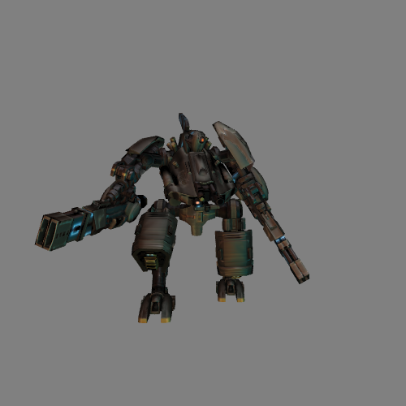
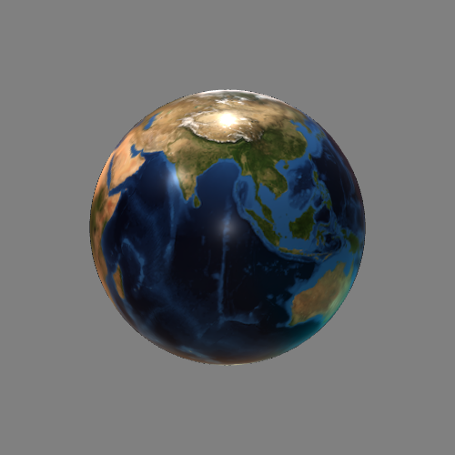
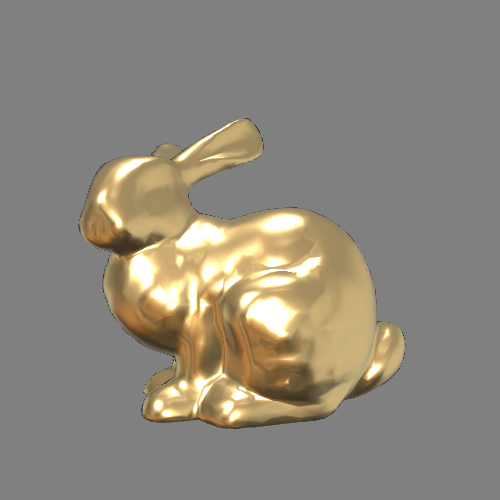
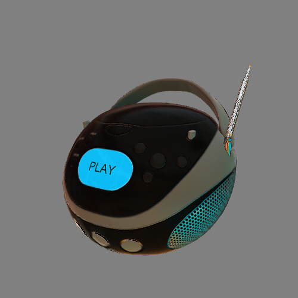

Advanced Graphics: Homework Assignment 4: Shaders
===================================================

Goals:
------

* Understand how to program shaders that run on the GPU.

* Become familiar with setting up a modern GPU drawing pipeline.

* Understand cartoon shading.

* Understand Physically-Based Rendering (PBR).

* Understand texture coordinates.

* Understand tangent-space normal mapping.

* Understand how to compute a tangent-space from texture coordinates.

* Understand cube maps.

Background
---------

* Topics: The Graphics Pipeline, Viewing, Illumination, Texture Mapping, Meshes, Physically-Based Rendering.
* *Fundamentals of Computer Graphics (4th edition)* by Steve Marschner and Peter Shirley: Chapter 17 *Using Graphics Hardware*.
* The [Filament](https://google.github.io/filament/Filament.md.html) documentation. (Filament is a real-time physically based rendering engine.)
* Thorsten Thormählen's slides on [Light and Materials](https://www.mathematik.uni-marburg.de/~thormae/lectures/graphics1/graphics_10_1_eng_web.html) and [Image-based Lighting](https://www.mathematik.uni-marburg.de/~thormae/lectures/graphics1/graphics_10_2_eng_web.html).
* SIGGRAPH 2014 course notes: [*Moving Frostbite to Physically Based Rendering 3.0* by Sébastien Lagarde and Charles de Rousiers](https://seblagarde.wordpress.com/wp-content/uploads/2015/07/course_notes_moving_frostbite_to_pbr_v32.pdf).
* The SIGGRAPH 2013 course notes [*Real Shading in Unreal Engine 4* by Brian Karis](https://cdn2.unrealengine.com/Resources/files/2013SiggraphPresentationsNotes-26915738.pdf).
* *Physically Based Rendering: From Theory To Implementation (4th edition)* by Matt Pharr, Wenzel Jakob, and Greg Humphreys: [Chapter 9 *Reflection Models*](https://pbr-book.org/4ed/Reflection_Models).


Getting Started & Handing In:
-----------------------------

* Download or clone this code repository. I recommend cloning so you can easily integrate updates I release while you are working on the project. Don't fork it on GitHub, or else your code will be visible to everyone.

* Install a working native C++ development environment. An example of doing that is here: <https://github.com/yig/graphics101>.

  * Optional: Install the [glfw](https://www.glfw.org/) library for creating an OpenGL window. If you don't install it this way, the `CMakeLists.txt` will download and compile `glfw` on the fly.

      * Mac with Homebrew package manager: `brew install glfw`.
      * Ubuntu Linux: `sudo apt-get install libglfw3-dev`.
      * Windows: It's complicated. Just let the `CMakeLists.txt` compile it for you. If you really want to, you can use [vcpkg](https://github.com/microsoft/vcpkg). If you cloned `vcpkg` as `C:\src\vcpkg`:
      
            git clone https://github.com/microsoft/vcpkg
            .\vcpkg\bootstrap-vcpkg.bat
            .\vcpkg\vcpkg install glfw3
        
        if you are using a 64-bit Windows compiler toolchain, replace the last command with:
        
            .\vcpkg\vcpkg install glfw3:x64-windows
        
        and then copy the GLFW folder `vcpkg` installs to your `Program Files` or else add the following flag to your `cmake -B build-dir`:
        
            -DCMAKE_TOOLCHAIN_FILE=C:\src\vcpkg/scripts/buildsystems/vcpkg.cmake

* The code will be written in GLSL (OpenGL shading language) and C++. You
are encouraged to write helper functions as you like.

* Copy the `mesh.cpp`'s functions `computeNormals()`, `normalizingTransformation()`, and `applyTransformation()` from the `mesh.cpp` I have provided separately.

* Setup your build directory with `cmake -B build-dir`.

* Build and run the code with `cmake --build build-dir`. The code should compile. When it runs, it will
ask you to choose a JSON file specifying a scene. It can also be run
as a command-line program taking a single argument, the path to the JSON
file. That way you can specify a command-line argument in Qt Creator and
simply run. Run these two JSON scene files to verify that everything is
working. They don't depend on any code you write:

        simplescene.json
        sphere.json

    You should see:

    
    
    
    Once you add the missing code to `vao.cpp`, `sphere.json` will look as follows:
    
    

* Implement `vao.cpp`'s `makeFromMesh()` to upload normals and texture coordinates to the GPU as per-vertex attributes. Create your vertex shader and fragment shaders for each shader. Modify the JSON scene files as needed. Tangent-space normal mapping will require you to modify additional C++ code (`mesh.cpp`'s `computeTangentBitangent()` and `fancyscene.cpp`'s `vaoFromOBJPath()`).

* Build and run and test that it is working correctly. If you run the `pipeline` program with the `-h` or `--help` flag, you should see the following:

        Usage: ./pipeline [--width pixels] [--height pixels] [--screenshot path/to/save.png] [path/to/scene.json]

* Check your work with the [autograder](https://github.com/yig/graphics662-pipeline-autograder).

* Here are the JSON scene files that will verify your output.
Save screenshots by pressing the `s` key or by passing `--screenshot output.png` to the executable. Save a screenshot for each of the JSON
scenes into an output subdirectory `screenshots`.

    * `matcap_bunny.json`
    * `matcap_head.json`
    * `matcap_sphere.json`
    * `pbr_boombox-nonormals-direct.json`
    * `pbr_boombox-nonormals-sampled.json`
    * `pbr_boombox-normals-direct.json`
    * `pbr_boombox-normals-sampled.json`
    * `pbr_bunny.json`
    * `pbr_cube2.json`
    * `pbr_earth.json`
    * `pbr_robot.json`
    * `pbr_sphere-dielectric-direct-lights.json`
    * `pbr_sphere-dielectric-direct.json`
    * `pbr_sphere-dielectric-sampled.json`
    * `pbr_sphere-metal-direct.json`
    * `pbr_sphere-metal-sampled.json`
    * ... and any others that you make.

* There is a cmake target `screenshots` that will do this for you, so you can just type `cmake --build build-dir --target screenshots`.

* You will find reference output in the `examples/` directory.
For each `<filename>.json` file, there is a `<filename>.png` screenshot
taken from the default point of view.

* Debugging is tricky for shaders. When there are errors compiling your GLSL code, you will see the shader code and the line number printed out to the console. You can't set a breakpoint or put a print statement in GLSL code. You have to cleverly modify vertex positions and pixel colors to visualize what you are debugging.

* Create a file named `Notes.txt` in the folder. Describe any known issues or extra features or things you attempted but did not finish.
Name people in the class who deserve a star for
helping you (not by giving your their code!).

* When done, run `cmake --build build-dir --target zip`
to generate an appropriate zip file of your `pipeline` project.
The zip file it creates, `pipeline.zip`, will include
the `screenshots` subdirectory and your `Notes.txt` file.
It will ignore unneeded large and numerous directories
(e.g. `build-dir`).
Upload your `pipeline.zip` to Canvas before the deadline.

* **THIS IS AN INDIVIDUAL, NOT A GROUP ASSIGNMENT. That means all code
written for this assignment should be original! Although you are
permitted to consult with each other while working on this assignment,
code that is substantially the same will be considered cheating.** In your
`Notes.txt`, please note who deserves a star (who helped you with the
assignment).

Overview:
---------

In this assignment, you will be writing GLSL shaders. You will write a real-time
physically-based renderer supporting the metallic-roughness material model in glTF [[1]](https://github.com/KhronosGroup/glTF-Tutorials/blob/main/gltfTutorial/gltfTutorial_010_Materials.md) [[2]](https://registry.khronos.org/glTF/specs/2.0/glTF-2.0.html#materials). You will load high resolution
normals from a texture and implement tangent-space normal mapping. (For
this, you will also need to implement some additional mesh processing to
create additional per-vertex attributes.) You will write a cartoon
shader. For bonus, you can also write additional shaders and write
OpenGL code to setup a different rendering pipeline. Your output will
look like this:







Rubric:
-------

### 1. Physically-based rendering (40 points)

Our goal is to evaluate the rendering equation to obtain the outgoing radiance $L$ along rays from a surface point $\mathrm{p}$ in the direction $\omega _ o$ of a pixel:

$$L _ o(\mathrm{p}, \omega _ o) = L _ e(\mathrm{p}, \omega _ o) + \int _ {H^2} f(\mathrm{p}, \omega _ i \rightarrow \omega _ o) L _ i(\mathrm{p}, \omega _ i) \cos \theta _ i \ \mathrm{d}\omega _ i$$

Rasterization will give us a chance to evaluate this integral at each point $\mathrm{p}$ that is visible from our camera at a pixel. In eye-space (sometimes called camera-space or view-space), the camera is located at the origin, so we can trivially obtain the outgoing direction $\omega _ o$. (In shaders, $\omega _ o$ is often called $v$ as in *view direction*. It points away from $\mathrm{p}$.) The $L _ e(\mathrm{p}, \omega _ o)$ term corresponds to any light emission directly from the surface. The integral is more challenging. We have to consider all possible directions $\omega _ i$ along which light $L _ i$ could travel to the point $\mathrm{p}$. (In shaders, $\omega _ i$ is often called $l$ as in *light direction*. It points away from $\mathrm{p}$.) We attenuate the light $L _ i$ arriving at $\mathrm{p}$ by the projected area of $\omega _ i$ onto the surface at $\mathrm{p}$. (If $n$ is the surface normal at $\mathrm{p}$, this attenuation factor is $n \cdot l$.) We attenuate the light leaving $\mathrm{p}$ by the BRDF (bidirectional reflectance function) $f$. The physically-based aspect of our calculations will be in the BRDF, which will model real-world materials. We will follow [Filament](https://google.github.io/filament/Filament.md.html#materialsystem)'s material formulas, which is to say a microfacet surface model. Our BRDF $f$ will be the sum of a Lambertian diffuse term $f _ d$ and a Cook-Torrance specular term $f _ r$. The diffuse term is easy to write: $f _ d = \frac{\sigma}{\pi}$, where $\sigma$ is the diffuse color of the surface. The specular term is more complex. The [Filament documentation](https://google.github.io/filament/Filament.md.html#materialsystem/standardmodelsummary) provides the following GLSL code:

```glsl
float D_GGX(float NoH, float a) {
    float a2 = a * a;
    float f = (NoH * a2 - NoH) * NoH + 1.0;
    return a2 / (PI * f * f);
}

vec3 F_Schlick(float u, vec3 f0) {
    return f0 + (vec3(1.0) - f0) * pow(1.0 - u, 5.0);
}

float V_SmithGGXCorrelated(float NoV, float NoL, float a) {
    float a2 = a * a;
    float GGXL = NoV * sqrt((-NoL * a2 + NoL) * NoL + a2);
    float GGXV = NoL * sqrt((-NoV * a2 + NoV) * NoV + a2);
    return 0.5 / (GGXV + GGXL);
}

float Fd_Lambert() {
    return 1.0 / PI;
}

void BRDF(...) {
    vec3 h = normalize(v + l);

    float NoV = abs(dot(n, v)) + 1e-5;
    float NoL = clamp(dot(n, l), 0.0, 1.0);
    float NoH = clamp(dot(n, h), 0.0, 1.0);
    float LoH = clamp(dot(l, h), 0.0, 1.0);

    // perceptually linear roughness to roughness (see parameterization)
    float roughness = perceptualRoughness * perceptualRoughness;

    float D = D_GGX(NoH, roughness);
    vec3  F = F_Schlick(LoH, f0);
    float V = V_SmithGGXCorrelated(NoV, NoL, roughness);

    // specular BRDF
    vec3 Fr = (D * V) * F;

    // diffuse BRDF
    vec3 Fd = diffuseColor * Fd_Lambert();

    // apply lighting...
}
```

#### Material parameters

Our BRDF models materials with several physical parameters.
All the parameters are stored as uniforms, which are global variables for shaders programs.
The user-facing parameters are:

* `material.base_color`: An RGB value for the base color of the surface. If `material.use_base_color_map` is true, multiply this by `texture( material.base_color_map, fTexCoord ).rgb`.
* `material.metallic`: A scalar value from 0 to 1 for how metallic the surface is. If `material.use_metallic_roughness_map` is true, multiply this by `texture( material.metallic_roughness_map, fTexCoord ).b`.
* `material.perceptual_roughness`: A perceptual roughness value. This is the square root of the actual roughness. It should [never be zero (0.0 is fine)](https://google.github.io/filament/Filament.md.html#materialsystem/parameterization/remapping/roughnessremappingandclamping). If `material.use_metallic_roughness_map` is true, multiply this by `texture( material.metallic_roughness_map, fTexCoord ).g`.
* `material.reflectance`: A scalar value from 0 to 1 representing the fraction of light reflected back at normal incidence.
* `material.emissive_map`: If the boolean `material.use_emissive_map` is set, look up and add the $L _ e(\mathrm{p}, \omega _ o)$ emission term via `texture( material.emissive_map, fTexCoord ).rgb`. Otherwise, the surface is not emmisive.

We convert these parameters to the internal values needed for our BRDF via:

```glsl
vec3 diffuseColor = (1.0 - metallic) * base_color.rgb;
vec3 f0 = 0.16 * reflectance * reflectance * (1.0 - metallic) + base_color * metallic;
float roughness = clamp( perceptual_roughness * perceptual_roughness, 0.01, 1.0 );
```

#### Ambient Occlusion

You should support an ambient occlusion map, which stores the amount of self-shadowing at each point of the object. (It's a global illumination hack.) If `material.use_occlusion_map` is true, you should attenuate the Lambertian BRDF by `texture( material.occlusion_map, fTexCoord ).r;` or, equivalently, attenuate `diffuseColor`, since that is only used to scale the Lambertian BRDF.


#### Directional lights

[Directional lights](https://google.github.io/filament/Filament.md.html#lighting/directlighting/directionallights) are a convenient special case of the integral. These lights contribute light only along a given direction, so we can skip summing over all possible directions and simply iterate over the light directions. In other words, we get to replace:

$$\int _ {H^2} f(\mathrm{p}, \omega _ i \rightarrow \omega _ o) L _ i(\mathrm{p}, \omega _ i) \cos \theta _ i \ \mathrm{d}\omega _ i$$

with

$$\sum _ {i=1} ^ {N} f(\mathrm{p}, \omega _ i \rightarrow \omega _ o) L _ i \cos \theta _ i$$

where the incident radiance $L _ i =$ `lights[i].color`, the direction towards the light $\omega _ i =$ `-lights[k].direction`, $\cos \theta _ i = n \cdot \omega _ i$, and $N =$ `num_lights`.

(Point lights and spot lights are fairly easy to add, too, but they are not a mandatory part of this assignment.)

#### Image-based lighting

To go (way) beyond directional lights, it is common to sample the physical world and record and store the light coming from all directions in a special texture called an environment map or skybox. We load an environment map as six images, one for each of the six faces of a virtual cube enclosing the world. This format is called a cube map. The `texture()` lookup for a cube map takes a 3D direction as its texture coordinates and returns whatever color the direction points to. That's perfect for our needs.

With an environment map, there's no getting around evaluating the integral *somehow*. Since that is expensive, real-time applications usually precompute something which can be used to approximate the integral. We will use a simple technique to do this. There are fancier techniques (which you can complete for bonus).

**Diffuse lighting**. Recall that the diffuse component of the BRDF scatters incoming light equally in all directions. For a given point on the surface, we want to take in light from all visible directions (the hemisphere aligned with the point's normal) and project it with the cosine term. In other words, we are accumulating all visible light from the normal direction. This is the same as taking an average of all the visible light and multiplying by the area of integration ($\pi$ for the unit circle we project onto). To be accurate, we should take a cosine-weighted average, but an unweighted average will be a close approximation and easy to implement with [mipmaps](https://en.wikipedia.org/wiki/Mipmap).

The mipmaps of a texture are its image pyramid: the sequence of images obtained by shrinking the width and height by a factor of two each time. A $1024 \times 1024$ texture will have mipmap levels $512 \times 512$, $256 \times 256$, and so on down to $1 \times 1$. Level 0 is the original texture. The maximum mipmap level is (in GLSL) `1 + floor(log2(textureSize(tex,0).x))`. Our C++ framework automatically generates mipmaps for all loaded textures. (In OpenGL, it's as easy as calling `glGenerateMipmap()`.) When fetching values from a texture in GLSL, we can use `textureLod( tex, uv, level )` to sample the texture `tex` with texture coordinates `uv` at the given `level`.

> 🙅: Calling `texture( tex, uv )` will automatically pick a mipmap level, but that's not appropriate for our needs, since the automatic level is chosen based on using the texture sample directly as the pixel color, rather than indirectly as we are doing.

With our mipmap approximation, we can replace the integral over the diffuse component of the rendering equation:

$$\int _ {H^2} f _ d(\mathrm{p}, \omega _ i \rightarrow \omega _ o) L _ i(\mathrm{p}, \omega _ i) \cos \theta _ i \ \mathrm{d}\omega _ i$$

with a direct lookup:

$$\pi f _ d I(n)$$

where $f _ d = \frac{\mathrm{diffuseColor}}{\pi}$, $I(n) = \mathrm{textureLod}( \mathrm{environment\_map}, n, \mathrm{maxLevel}-1 )$, and $n$ is the surface normal at $\mathrm{p}$.

**Numerical integration (bonus)**: If `num_samples_diffuse` $>0$, sample many incoming light directions on the hemisphere above $\mathrm{p}$. Add up the diffuse lighting. In other words, replace:

$$\int _ {H^2} f _ d(\mathrm{p}, \omega _ i \rightarrow \omega _ o) L _ i(\mathrm{p}, \omega _ i) \cos \theta _ i \ \mathrm{d}\omega _ i$$

with

$$\frac{2\pi}{N} \sum _ {i=1} ^ {N} f _ d I(\omega _ i) \cos \theta _ i $$

where $f _ d = \frac{\mathrm{diffuseColor}}{\pi}$, $I(\omega _ i) = \mathrm{textureLod}( \mathrm{environment\_map}, \omega _ i, 0 )$, $\omega _ i$ is the uniformly sampled direction, $\cos \theta _ i = n \cdot \omega _ i$, and $n$ is the surface normal at $\mathrm{p}$.

To get a uniformly sampled normal on the hemisphere, you could use a Fibonacci lattice [[1]](https://stackoverflow.com/questions/9600801/evenly-distributing-n-points-on-a-sphere) [[2]](https://extremelearning.com.au/how-to-evenly-distribute-points-on-a-sphere-more-effectively-than-the-canonical-fibonacci-lattice/). However, we will instead use a more general approach that will also serve us when numerically integrating specular reflection.

This more general approach is a two step process. We first generate a 2D point $(x,y)$ uniformly distributed in the unit square $[0,1]^2$. We then transform this 2D point to spherical $\phi, \theta$ coordinates. We won't generate our $(x,y)$ points by iterating from 0 to 1 in fractional increments, since that leads to aliasing artifacts. We will generate them using a pseudo-random Hammersley sequence:

```glsl
/*
Call `hammersley()` with `i` from 0 to `N-1` to get points evenly distributed on the unit square [0,1)^2.
Source: <https://web.archive.org/web/20230412142209/http://holger.dammertz.org/stuff/notes_HammersleyOnHemisphere.html>
*/
vec2 hammersley(uint i, uint N)
{
    uint bits = i;
    bits = (bits << 16u) | (bits >> 16u);
    bits = ((bits & 0x55555555u) << 1u) | ((bits & 0xAAAAAAAAu) >> 1u);
    bits = ((bits & 0x33333333u) << 2u) | ((bits & 0xCCCCCCCCu) >> 2u);
    bits = ((bits & 0x0F0F0F0Fu) << 4u) | ((bits & 0xF0F0F0F0u) >> 4u);
    bits = ((bits & 0x00FF00FFu) << 8u) | ((bits & 0xFF00FF00u) >> 8u);
    float y = float(bits) * 2.3283064365386963e-10; // / 0x100000000
    
    return vec2(float(i)/float(N), y);
}
```

The formula for mapping $(x,y)$ to a uniform sampling of the hemisphere in polar coordinates is [[1]](https://www.mathematik.uni-marburg.de/~thormae/lectures/graphics1/graphics_10_2_eng_web.html#12):

$$
\begin{align*}
\phi &= 2 \pi x \\
\theta &= \arccos( 1 - y )
\end{align*}
$$

In Cartesian coordinates, this is $( \cos( \phi ) \sin( \theta ), \sin( \phi ) \sin( \theta ), \cos( \theta )$.

Note that these points will be distributed on the hemisphere aligned with $(0,0,1)$, which is the normal in tangent space. We need to rotate these points back to view space where the rest of our calculations are performed. The minimal rotation that aligns a vector $v$ with another vector $w$ rotates about the axis $v \times w$ by $\arccos( v \cdot w )$ radians. I have provided a routine that creates a rotation matrix from an axis and angle.

(There are [other approaches](https://www.mathematik.uni-marburg.de/~thormae/lectures/graphics1/graphics_10_2_eng_web.html#11) to sampling a hemisphere with different distributions. For diffuse lighting, you could importance sample based on $n \cdot l$. We will discuss importance sampling below for specular numerical integration.)

**Specular lighting**. Specular lighting depends on both the normal and view direction, but further appromixations make precomputation possible. The approximation used in the Unreal Engine and Filament is the split-sum approximation [[1]](https://cdn2.unrealengine.com/Resources/files/2013SiggraphPresentationsNotes-26915738.pdf) [[2]](https://www.mathematik.uni-marburg.de/~thormae/lectures/graphics1/graphics_10_2_eng_web.html#38)). We will use a simpler approximation, again based on mipmaps.

Our key observation is that our specular lobe is centered around the reflected view direction $l = \mathrm{reflect}( -v, n )$. (`reflect()` is a GLSL function.) In other words, light coming from $l$ has the least attenuation (highest influence). The amount of attenuation is based on the angle with respect to $l$ *and* the roughness parameter. Surfaces with roughness $= 1.0$ exhibit diffuse-like scattering. Integrating over the lobe is again like taking a weighted average over all light directions and multiplying by the area of integration ($\pi$ for the unit circle we project onto). In the case of specular reflection, we can approximate the weighted average by sampling the cube map once in the $l$ direction with a mipmap level somewhere between 0 and the maximum level. We have one more modification to make. We need to divide by the probability $p(l)$ of light coming from this direction. (See the bonus numerical integration section for pointers to derivations of this probability.)

In summary, we can replace the integral over the specular component of the rendering equation:

$$\int _ {H^2} f _ r(\mathrm{p}, \omega _ i \rightarrow \omega _ o) L _ i(\mathrm{p}, \omega _ i) \cos \theta _ i \ \mathrm{d}\omega _ i$$

with a direct lookup:

$$\frac{f _ r(\mathrm{p}, l \rightarrow \omega _ o)}{p(l)} I(l) \ n \cdot l$$

where
$p(l) = \frac{D _ {GGX}}{4 ( v \cdot n)}$,
$I(l) = \mathrm{textureLod}( \mathrm{environment\_map}, l, (\mathrm{maxLevel}-1) \cdot \mathrm{perceptualRoughness}^\frac{1}{4})$.

> I chose that power of `perceptualRoughness` by eye-balling the results compared to numerical integration.

**Numerical integration (bonus)**: If `num_samples_specular` $>0$, sample many incoming light directions on the hemisphere above $\mathrm{p}$. Add up the specular lighting. This is similar to the above for diffuse lighting, but a uniform sampling strategy will look terrible. Instead, we have to use importance sampling, which says that we can approximate any integral by a weighted sum $\int _ {x\in S} g(x) dx \approx \frac{1}{N} \sum_{i=1}^N \frac{g(x _ i)}{p( x _ i )}$. The points $x _ i$ where we sample our integral can be non-uniformly distributed so that we spend more time sampling locations that contribute a lot to the integral ($|g(x)|$ is large) and less time sampling locations where $|g(x)|$ is small. The denominator $p(\omega _ i)$ can be any probability density function that integrates to 1.

With this in mind, we replace:

$$\int _ {H^2} f _ r(\mathrm{p}, \omega _ i \rightarrow \omega _ o) L _ i(\mathrm{p}, \omega _ i) \cos \theta _ i \ \mathrm{d}\omega _ i$$

with

$$\frac{1}{N} \sum _ {i=1} ^ {N} \frac{f _ r(\mathrm{p}, \omega _ i \rightarrow \omega _ o)}{p(\omega _ i)} I(\omega _ i) \cos \theta _ i $$

where $I(\omega _ i) = \mathrm{textureLod}( \mathrm{environment\_map}, \omega _ i, 0 )$, $\omega _ i$ is the non-uniformly sampled direction, $\cos \theta _ i = n \cdot \omega _ i$, and $n$ is the surface normal at $\mathrm{p}$.

The [right non-uniform sampling strategy to use](https://www.mathematik.uni-marburg.de/~thormae/lectures/graphics1/graphics_10_2_eng_web.html#11) is based on our microfacet distribution $D _ {GGX}$. We want to sample points around the peak of our specular lobe. The peak is centered around the reflection of the view vector across the normal. However, we don't want to generate samples "around" that reflected direction, because many of them won't be valid (outside the hemisphere) which causes problems for our probability density function $p$. Instead, we generate samples centered around the normal vector (like with diffuse reflection but following a different distribution). We interpret these samples as halfway vectors $h$ between the view $v$ and unknown light direction $l$ we ultimately wish to sample. Formally, $h = \frac{v+l}{\|v+l\|}$. We can obtain the light direction by reflecting the view direction across the halway vector: $l = \mathrm{reflect(-v,h)}$.

We will use the same general sampling strategy as for numerical integration of diffuse reflection. Given a 2D uniformly distributed point $(x,y)$, we can obtain a spherical coordinate that follows the $D _ {GGX}$ distribution [via](https://www.mathematik.uni-marburg.de/~thormae/lectures/graphics1/graphics_10_2_eng_web.html#14):

$$
\begin{align*}
\phi &= 2 \pi x \\
\theta &= \arccos\left( \sqrt{ \frac{1-y}{y(\alpha^2-1)+1} } \right)
\end{align*}
$$

Again, these points are distributed on the hemisphere aligned with $(0,0,1)$. Rotate these points back to view space to get the halfway vectors $h$.

The probability density function [is](https://www.mathematik.uni-marburg.de/~thormae/lectures/graphics1/graphics_10_2_eng_web.html#14): $$p(\omega _ i) = \frac{D _ {GGX} \cos( \theta )}{4 ( v \cdot h)}$$

where $v$ is the view vector.

> Careful observers may wonder about the missing $\sin(\theta)$ term in $p(\omega _ i)$. The $\sin(\theta)$ term appears when integrating in spherical coordinates, but we have been writing our integrals directly in steradians. Drop the $\sin(\theta)$ term from [all of the probability density functions](https://www.mathematik.uni-marburg.de/~thormae/lectures/graphics1/graphics_10_2_eng_web.html#11). You can see it and the appearance of the $4 ( v \cdot h)$ denominator by following the change of variables derivation on [these slides](https://www.mathematik.uni-marburg.de/~thormae/lectures/graphics1/graphics_10_2_eng_web.html#32) or in Sections 3.1 and 3.2 of [this technical report](https://www.graphics.cornell.edu/~bjw/wardnotes.pdf) or in the [Physically Based Rendering book](https://pbr-book.org/4ed/Reflection_Models/Roughness_Using_Microfacet_Theory#x5-TheHalf-DirectionTransform).

#### 1.1 Upload data to the GPU (`vao.cpp`) (10 points)

Upload the normals and texture coordinates to the GPU as per-vertex attributes. To do this, you will implement `vao.cpp`'s `makeFromMesh()`. You will see in that function how `mesh.positions` are uploaded. Do the same for `mesh.normals` and `mesh.texcoords`.

#### 1.2 Vertex Shader `pbr.vs` (5 points)

Your vertex shader only needs to transform the positions and normals. (Your fragment shader is where the lighting is calculated.)
Use the provided uniforms
`uProjectionMatrix`, `uViewMatrix`, and `uNormalMatrix` to transform the input
world-space position `vPos` and normal `vNormal` into eye-space and pass them *out* to the
fragment shader and set the output variable `gl_Position`. Pass the
texture coordinate `vTexCoord` out unchanged.

* `fPos`, `fNormal`, and `fTexCoord` are output variables, which is how you pass
along this information to the fragment shader, which is where you do
your lighting calculations. You can pass along `fPos` and `fNormal` in
world-space or in eye-space, so long as you use a consistent space when
you compute your lighting.
I suggest eye-space, since the environment map and light directions are provided in eye-space.
(If you want to compute lighting in
world-space, you will have to convert the light direction and the eye
position into world-space by multiplying them with `inverse(uViewMatrix)`.)

* Ignore the `fTangent` and `fBitangent` output variables for now. (They may be set to a dummy value for the shader to compile.) You will use them later when you implement [tangent-space normal mapping](#3-tangent-space-normal-mapping-40-points).

* `uViewMatrix` is the matrix that converts a position in world-space into a
position in eye-space: `uViewMatrix*p` converts `p` from world to
eye-space.
`uNormalMatrix` is the matrix that converts a normal from world-space to a
normal in eye-space. It is equal to
`transpose(inverse(mat3(uViewMatrix)))`.

* `uProjectionMatrix` is the matrix that converts a position from
eye-space to normalized-device coordinates.

* `gl_Position` is the one variable you are required to assign in any
vertex shader, so that the GPU knows which pixels are inside the
triangle. You must set `gl_Position` to the position in normalized device
coordinates.

#### 1.3 Fragment Shader `pbr.fs` (25 points)

Implement the physically-based rendering approach described above. After some initial setup, you start accumulating the radiance coming from the pixel as a `vec3 color`.

1. [Convert the user-facing material parameters to the internal values needed for our BRDF](#material-parameters).
2. Apply [ambient occlusion](#ambient-occlusion).
3. Add any emissive light to `color`.
4. Iterate over [directional lights](#directional-lights) and add their radiance. (5/25 points)
5. Add the diffuse component of the image-based lighting. (10/25 points)
6. Add the specular component of the image-based lighting. (10/25 points)
7. Set the output fragment color `FragColor = vec4( clamp( color, 0.0, 1.0 ), 1.0 );`

## 2. MatCaps with object-space normal mapping (20 points + bonus 3 points)

You only need to write a fragment shader `matcap.fs`,
since the same vertex shader as the one you wrote for PBR shading `pbr.vs` can be re-used.
A MatCap (Material Capture) is a delightfully simple and flexible technique to create realistic or artistic lighting for a shape. The idea is simple. Different points on a shape look different because the normals are different.
Think about the PBR reflectance model. In the simple case (no textures), the material parameters and lights are shared by every point on the object. The vector $v$ from the point to the eye varies slightly, but we could approximate this with a constant direction. This is all to say that the appearance of an object is almost entirely dependent on its normals in eye space.
A MatCap is a lookup table from a normal to a color. A sphere has normals pointing in all
directions. All we need to do is render a sphere and save its colors. To render,
we just need to look up the color of the sphere with that normal. In fact,
we only render the part of the shape we can see, so we only need to worry about
front-facing normals (with $z>0$ in eye-space). This gives us a very convenient way
to store the lookup table:


We store the front half of the sphere as a circle. To look up the color from the matcap, we just use the $x,y$ component of the normal scaled and shifted to lie in the range $[0,1]^2$ instead of $[-1,1]^2$: `color = texture( material.matcap_texture, n.xy*0.5 + 0.5 ).rgb`.
We can create MatCaps any way we like. We can render a sphere with physically-based materials in a sophisticated lighting environment:


We can also create an artistic sphere:


Those MatCaps create the following bunnies:


You can see lots of MatCaps visualized on 3D shapes [here](https://observablehq.com/@makio135/matcaps?ui=classic).

* **(10 points)** In `matcap.fs`, set the output color
to the color stored in the MatCap texture for the eye-space normal `fNormal`.
If `material.use_base_color_map`, multiply the color by the diffuse texture color `texture( material.base_color_map, fTexCoord ).rgba`.

* **(10 points)** Object-space normal mapping. Texture resolution is typically much higher than vertex resolution. This is why we typically store colors in a texture map and not as vertex attributes. Along these same lines, we can store normals in a normal map in order to have render super-detailed surfaces. Normal maps are typically stored
in tangent-space, which is substantially more difficult to implement. (Tangent-space normal mapping is described below. Consider this a warm up.)
In `matcap.fs`, if `material.use_normal_map`, read the object-space
normal from the texture via
`texture( material.normal_map, fTexCoord ).rgb`.
Normal components range
from [-1,1], while colors range from [0,1], so each normal component
is stored in the texture as `0.5*(n+1)`. Convert the color stored in the normalmap texture back to a normal via `2*color-1`.
This normal is in object-space. Convert it to eye-space using `uNormalMatrix` and then use it instead of `fNormal` to read from the MatCap.

* **(bonus 5 points)** Make your own MatCap! You can make a toon shader MatCap by taking a screenshot of a toon-shaded sphere. You can also make much cooler stuff. Have fun with this.

## 3. Tangent-space normal mapping (40 points)

This is an extension of your PBR fragment shader. With normal mapping,
the texture stores a normal vector. Because lighting is entirely
determined by the normal vector, high resolution normals make a surface
look incredibly detailed. The normals in a normal map are typically
stored as vectors in the *tangent space* of the surface. This technique
requires you to compute a "tangent frame" for each vertex (tangent and
bitangent vectors to accompany the normal) and upload that to the GPU as
additional attributes. To do this, you will implement `mesh.cpp`
`computeTangentBitangent()` to compute the tangent frame and `fancyscene.cpp`
`vaoFromOBJPath()` to upload the additional attributes to the GPU.
(Computing and uploading this additional data for this shader won't get
in the way of the other shaders.) Each face has a well-defined tangent
frame derived from the texture coordinates of its vertices; see the
accompanying handout for details. Just like with per-vertex normals, you
will pre-compute each face's tangent frame vectors and average them at
the vertices. In your `pbr.vs` vertex shader, you will convert the tangent and
bitangent vectors from world-space to eye-space (using `uViewMatrix`) and
pass them to the fragment shader. In the `pbr.fs` fragment shader, if `material.use_normal_map` is true, you will
extract the tangent-space normal from the texture and convert it to
world-space with the tangent frame matrix. That will be the normal you
use for your lighting calculations. (You can reconstruct the
tangent-frame matrix from the tangent, bitangent, and normal. Don't
forget to normalize them.) Implementation note: Normal components range
from $[-1,1]$, while colors range from $[0,1]$, so each normal component
is stored in the texture as `0.5*(n+1)`. Convert the color back to a
normal via `2*color-1`.

* For a deeper explanation of the coordinate systems involved in tangent-space normal mapping, see [this PDF](docs/tangent_space_normal_and_bump_mapping.pdf).
    
* For a video explanation of normal mapping, see [this YouTube video](https://www.youtube.com/watch?v=yHzIx41eiD4).

* When debugging, you can use the normal map texture `normalmap_noop.png`, which is a no-op normal map containing the color (0.5,0.5,1.0). It should look unchanged with or without `material.use_normal_map`.

## 4. Create a time-varying artistic shader of your own design (bonus 10 points)

Be creative! Make use of the uniform `uTime`, which stores the seconds
since the program was launched. Declare it in your shader as `uniform float uTime;`
Be sure to set `TimerMilliseconds` in the scene JSON file to a non-negative number (16 corresponds to 60 frames-per-second).
See `sphere.json` for an example.

## 5. Additional bonus points (variable)

* Better PBR integral approximation. It could be precomputing the correct prefiltered diffuse lighting term. It could be numerical integration on-the-fly.

* Deferred rendering. Your fragment shader outputs the information needed to compute shading later (in a texture). Then, draw a rectangle covering the screen with that texture and actually compute the shading. This allows you to run the expensive shader only on pixels you know are visible (versus on every pixel, even if it gets covered).

* Ambient Occlusion computation. Either compute ambient occlusion in real-time with a multi-pass shader or create an ambient occlusion map yourself as a pre-process. Compute the fraction of directions that are blocked by the mesh (a ray exiting the point with that direction would intersect the mesh).

* Image Processing (blur, edge detect, etc.). Draw a full-screen textured
square. Your vertex shader should pass along the position and texture
coordinates, ignoring the view and projection transformations. Your
fragment shader accesses the texture value at the pixel and at nearby
pixels. You can use the GLSL function `textureSize( tex, 0 )` to get the texture
width and height in pixels so that you can generate texture coordinates
for the surrounding pixels.

* Ray Tracer or Signed Distance Field renderer. Implement ray tracing or
ray marching (as in some [ShaderToy](https://www.shadertoy.com) examples).
Just like with Image Processing, the vertex shader does nothing. The
fragment shader implements an entire ray tracer or ray marching. All
geometry is specified via uniforms.

* Animation. You can create a sequence of transformation matrices and
interpolate between them (linearly or with an easing function). You can
go further and implement linear blend skinning, in which there are
multiple sequences of transformation matrices animating in parallel, and
each vertex has a set of associated "skin" weights. The vertex is
transformed by the weighted average transformation matrix. Some of
the infrastructure for this is already implemented.

* Procedural textures. Generate a wood or marble color as a 3D function of
position.

* Geometry or tessellation shaders. We haven't talked about these more
exotic shaders, but the framework supports them.

* Something else!

Tips
----

* If you see a blank screen (all background color and no shape), the problem is most likely in your vertex shader. This is assuming that your environment works (e.g. that `simplescene.json` and `sphere.json` produce the expected output).

* The glm library is modeled after the OpenGL shading language GLSL.
Anything involving `vec2`, `vec3`, `vec4`, `mat3`, `mat4`, etc. and virtually any
GLSL functions should be accessible in C++ with the `glm::` prefix.
There are many convenience constructors and math operations.
Here is a nice reference: [GLSL Programming: Vector and Matrix Operations](https://en.wikibooks.org/wiki/GLSL_Programming/Vector_and_Matrix_Operations).

* The GLSL (and glm) matrix constructors that take vectors use those vectors
as the columns of the matrix, not the rows.
(If you want to fill out the rows, fill out the columns and then call `transpose()`.)
In fact, all matrix indexing uses column-then-row (column-major) ordering,
which is different from what mathematicians do.

* In C++ you can call the constructor of an object when you declare it,
like so:

        vec4 foo( 1.0, 2.0, 3.0, 4.0 );

    GLSL does not allow this and you will get a compile error. Instead, you
have to write:

        vec4 foo = vec4( 1.0, 2.0, 3.0, 4.0 );

* You often want to clamp dot products (of normalized vectors) so the result lies in the range [0,1]. For example, two vectors which face away from each other will produce a 0 rather than a negative number. You can do this in GLSL via `clamp( dot(a,b), 0.0, 1.0 )`.

* Unless you assign a value, a local variable you declare will be uninitialized.
While some implementations will initialize, for example, `vec3 foo;` to 0 by default,
the GLSL specification does not require this. (The grader's graphics driver
will probably initialize to random values.) Manually initialize to 0,
`vec3 foo = vec3(0);`, if that's what you want.

* There is a simple, sample 3D shader in `sphere.json` / `sphere.vs` /
`sphere.fs`. (The simplest possible shader is in `simplescene.json` /
`simplest.vs` / `simplest.fs` and is based off the `simplescene.h/cpp` C++ setup
code.)

* To convert a position from world-space to eye-space, left-multiply the
provided uniform `uViewMatrix` by the position. To convert a normal from
world-space to eye-space, use the provided uniform `uNormalMatrix`, which
is the inverse-transpose of the upper-left 3x3 portion of `uViewMatrix`.
To convert a position or direction from eye-to-world, use `inverse( uViewMatrix )`.
To convert a direction (other than a normal) from eye-to-world, you can be
more efficient and use `transpose( uNormalMatrix )`.

* The GLSL function `texture(...)`, which loads a value from a texture,
returns a `vec4`. Some overly permissive OpenGL drivers will allow you to
use it as a `vec3`, but that behavior is wrong. Use `texture(...).rgb` to
get the RGB components as a `vec3` or call
`vec3(texture(...))`.

* To reflect a (not necessarily normalized) vector **v** across a
normalized vector **n**, the formula for the reflected vector **r** is
**r = v - 2(v·n)n**. In GLSL, you can simply write `reflect(v,n)`.

    

* All of the required portions of the assignment can use the same C++
setup code (defined in `fancyscene.cpp`/`fancyscene.h`) and differ only in which
shaders and uniforms are specified in the JSON file. (Only normal
mapping requires you to modify some of the C++ setup code.)

* You can achieve better code re-use in the shaders if you split them up. When
you specify a shader in the JSON file, you can pass an array of file paths which
will be concatenated together in sequence and then compiled. This allows you to
write common helper functions in a `common.glsl` file if you so desire. The
first line must always be a `#version` directive, so I often split my complex
shaders into `[ shaderTop.vs, common.glsl, shaderBottom.vs ]`. It may also make
sense to share a bottom but have different middles (e.g. normal mapping and
Phong shading could share a bottom but have different middle files implementing
an appropriate `get_normal()` function).

* You can create your own C++ scene if you want to customize the camera or
attributes. You will need to duplicate the scene class (`SimpleScene` or
`FancyScene`) and register it with `pipelineguifactory.cpp`. For reference, you
can see/study the simplest-possible OpenGL scene in `simplescene.h` and
`simplescene.cpp`.

* Almost everything in a JSON scene will live reload if using a
`FancyScene`, including shaders, uniforms, and textures.
The only property that will not live reload is `PipelineGUI`.

* You can find lots of Creative Commons environment (cube) maps on the
website of Emil Persson, aka Humus:
<http://www.humus.name>

* You can find lots of MatCaps on this website: <https://github.com/nidorx/matcaps>. You can see all the MatCaps nicely visualized here: <https://observablehq.com/@makio135/matcaps?ui=classic>
